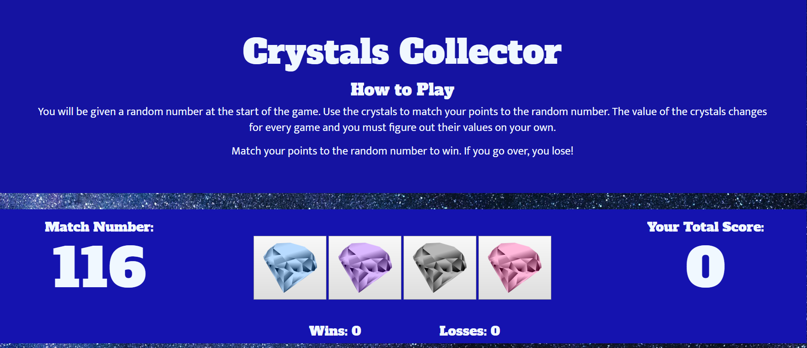

# Crystal Collector Game
jQuery Assignment
A Fun jQuery Guessing Game

This is a front-end application the uses HTML5, CSS, JavaScript and jQuery. This particular project highlights using jQuery to dynamically update the HTML of the application.

### Other Features
The page was built using Bootstrap for responsiveness.
This application contains alerts and the logic has timeouts to allow the final scores to render before the alert executes.

### How to Play
You will be given a random number at the start of the game. Use the crystals to match your points to the random number. The value of the crystals changes for every game and you must figure out their values on your own.

Match your points to the random number to win. If you go over, you lose!

### [Play the Game!](https://smit239.github.io/unit-4-game/)

Technology:
HTML5 | CSS3 | JavaScript | jQuery
Bootstrap | Google Fonts
